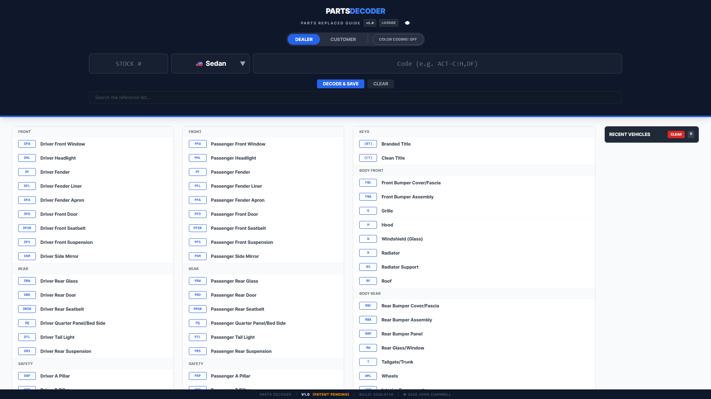
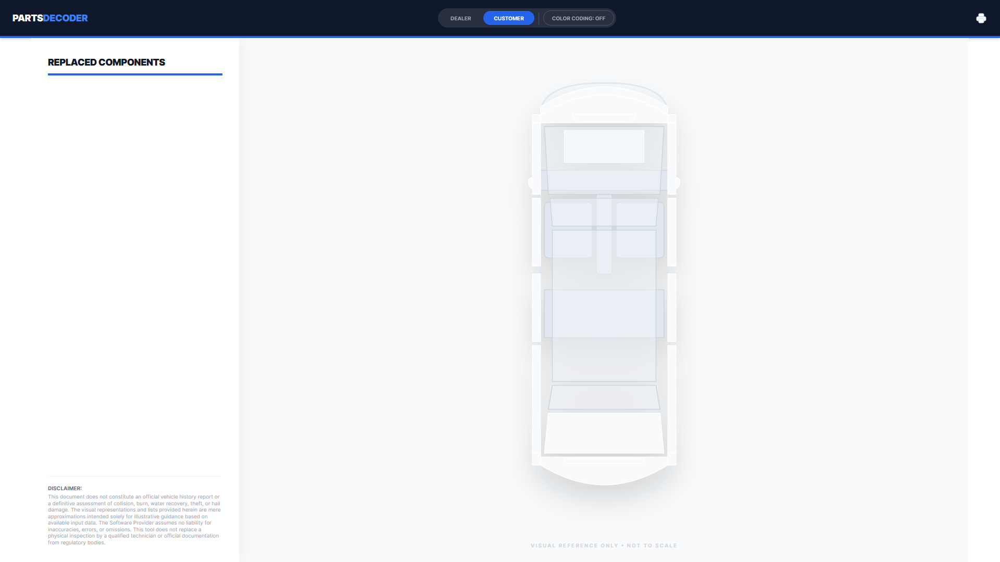
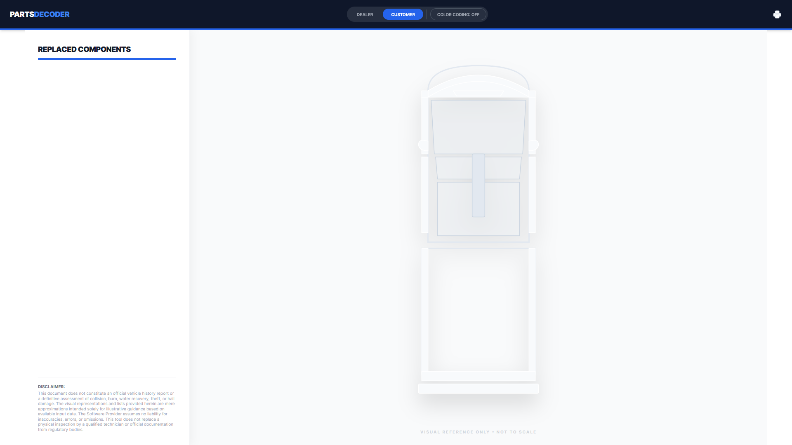

# Parts Decoder

**Parts Decoder** is a visual intelligence tool designed for automotive dealerships and repair facilities. It instantly translates shorthand repair codes (e.g., `ACT-C:H,DF,RS`) into interactive, color-coded visual maps, allowing service advisors to communicate complex vehicle damage to customers without technical jargon.

> **⚖️ LEGAL NOTICE:** This software and its "Severity Logic" visualization methods are protected by **U.S. Patent Application No. 63/960,641**. Unauthorized reproduction, reverse engineering, or implementation of the visual decoding methods described herein is strictly prohibited.

---

## 📸 Interface Preview

### 1. Dealer Mode (Data Entry)
*Optimized for high-speed entry with history logging and autocomplete.*

### 2. Customer Mode (Sedan)
*Instantly generates a clean, color-coded visual report for client presentation.*

### 3. Multi-Chassis Support (Truck)
*One-click toggle between chassis types re-maps all damage data instantly.*

---

## 🚀 Key Features

* **Instant Visualization:** Converts alphanumeric repair strings into dynamic SVG maps in milliseconds.
* **Severity Logic:** Automatically classifies parts as **Cosmetic** (Green), **Mechanical** (Yellow), or **Structural** (Red) based on safety implications.
* **Dual-Mode Interface:**
    * **Dealer Mode:** Internal view for Service Writers.
    * **Customer Mode:** Sanitized, print-ready visual report.
* **Zero-Latency Architecture:** Runs entirely client-side (no server roundtrips) for instant feedback.

## 📂 Licensing

This software is **Proprietary** and **Closed Source**. It is not available for public use or evaluation.

* **Commercial / Enterprise Use:** Use of this software in any business environment (e.g., Dealerships, Repair Shops) requires a paid commercial license and a valid license key.
* **Strictly Prohibited:** No free evaluation, personal use, or reverse engineering is permitted.

For licensing inquiries or enterprise deployment, please refer to: [EULA_ENTERPRISE.md](EULA_ENTERPRISE.md).

## 🔒 Security & Privacy

* **Client-Side Processing:** No vehicle data is sent to external servers. All decoding happens locally in the browser.
* **Data Persistence:** History is stored securely in local browser storage.

---
*Built by John Channell. Patent Pending 63/960,641.*
